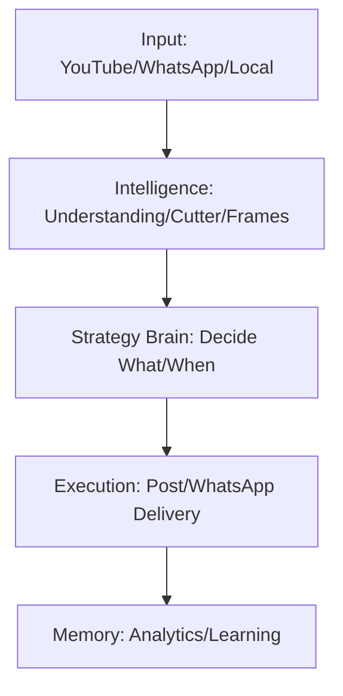

# BIRU_BHAI: The Solo Creator OS

## Executive Summary
**BIRU_BHAI** is an **Autonomous Personal Content OS** built for ONE individual creator.
It is not multi-user, not agency-based, and not artist-management software.

It exists to:
- **Think** like the creator.
- **Learn** from the creator’s content.
- **Operate** as their second brain + execution engine.

## Core Philosophy
- **One Creator = One System**
- **One Database = One Brain**
- **Optimize for Speed, Simplicity, and Learning**

## System Goal
Convert one long video or idea into:
1.  Viral short clips
2.  Posters / Frames
3.  Captions & Posting Strategy
4.  Analytics Feedback

## Architecture
### High-Level Flow

### Agent Topology (Single-Creator Mode)
1.  **Understanding Agent**: Transcribe, detect emotions/hooks.
2.  **Viral Cutter Agent**: Slice high-potential segments (vertical).
3.  **Frame Power Agent**: Extract frames, generate thumbnails.
4.  **Caption Agent**: Generate captions in creator's unique voice.
5.  **Strategy Brain**: The authoritative decision maker.
6.  **Engagement Agent**: Suggest polls, replies, interactions.
7.  **Analytics Agent**: Track growth and adjust strategy.
8.  **Memory Agent**: Store what works (long-term learning).
9.  **WhatsApp Control Agent**: The natural language command interface.

## Tech Stack
- **Backend**: Python + FastAPI
- **Orchestration**: LangGraph (Decision Making) + Celery (Heavy Lifting)
- **Database**: SQLite (MVP) -> PostgreSQL (Scale)
- **Video Processing**: FFmpeg (Async/Background)

## Documentation
For detailed specs, see [docs/SPECIFICATION.md](docs/SPECIFICATION.md).
